# Sandra Home and Organization

Sandra Home and Organization is a cleaning company based in Malmo, Sweden. With this project we try to show all of our different services to new costumers.

### Existing Features

- __Navigation Bar__

  - Featured on all three pages and the shortcut to About Us, the full responsive navigation bar includes links to the Logo, Home page, About Us, Gallery, and Contact page and is identical on each page to allow for easy navigation.
  - This section will allow the user to easily navigate from page to page across all devices without having to revert to the previous page via the ‘back’ button. 

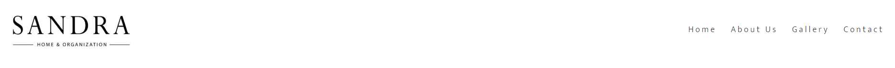

- __The landing page image__

  - The landing includes a photograph to allow the user to see how a house can be with our services. 
  - A motivation phrase under the main image.
  
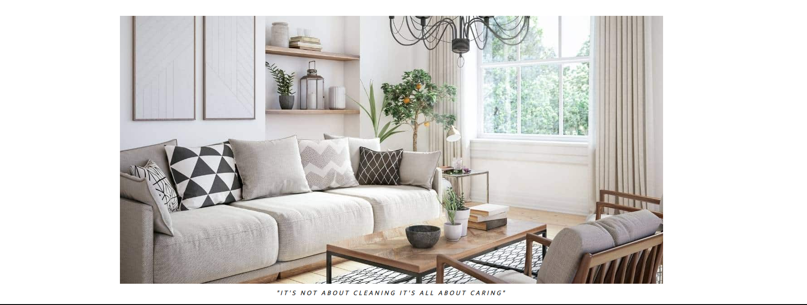

- __About Us Section__

  - Includes a small story about the company. 
  - In this section, we show our future custumers what type of services we have available.

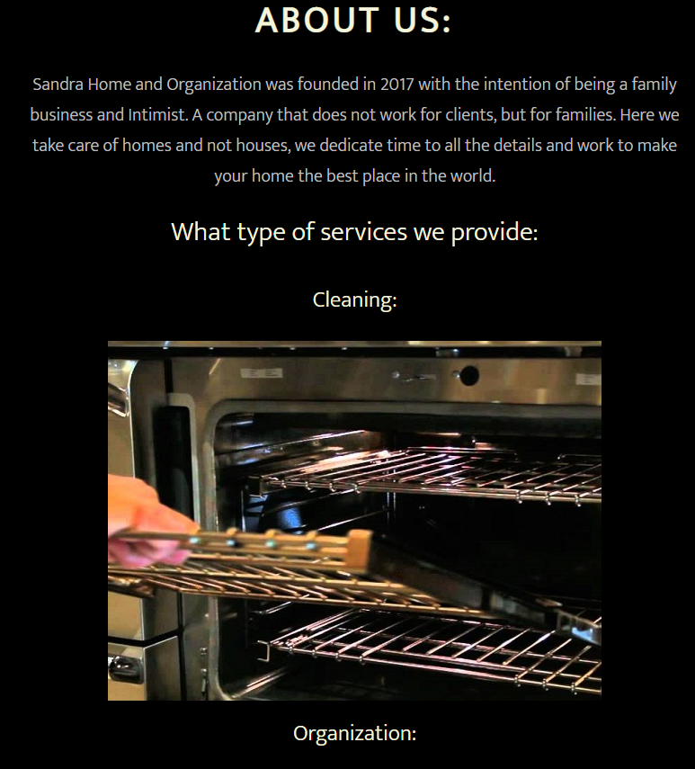

- __Why have us section__

  - This section will allow the user to see some benefits of having us as a cleaning company.  

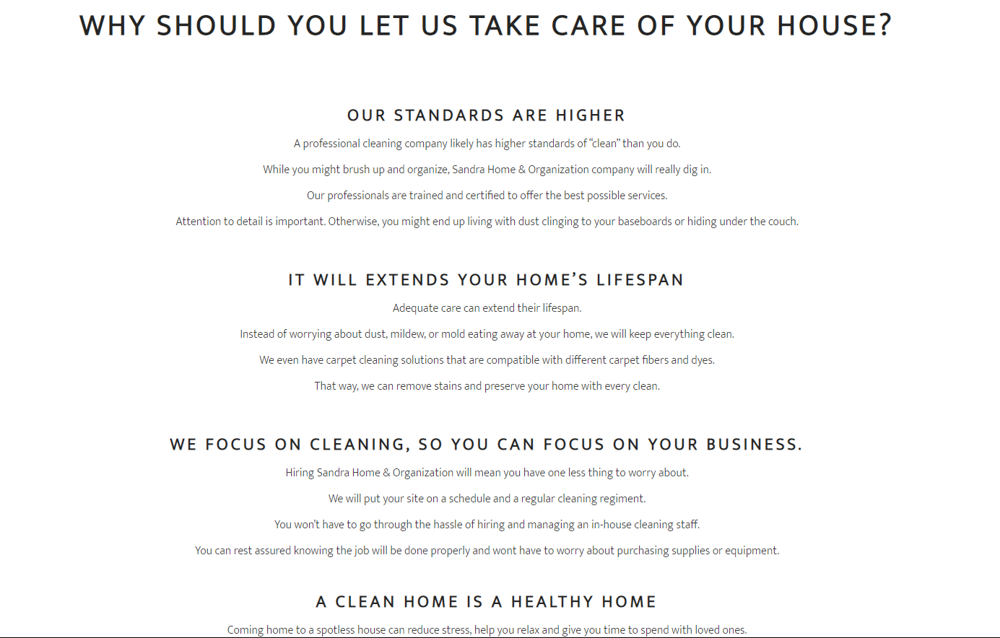

- __The Footer__ 

  - The footer section includes links to the relevant social media sites for Sandra Home and Organization. The links will open to a new tab to allow easy navigation for the user. 
  - The footer is valuable to the user as it encourages them to keep connected via social media

- __Gallery__

  - The gallery will provide the user with supporting images to see what our final projects look like. 
  - This section is valuable to the user as they will be able to easily identify the types of services we offer. 

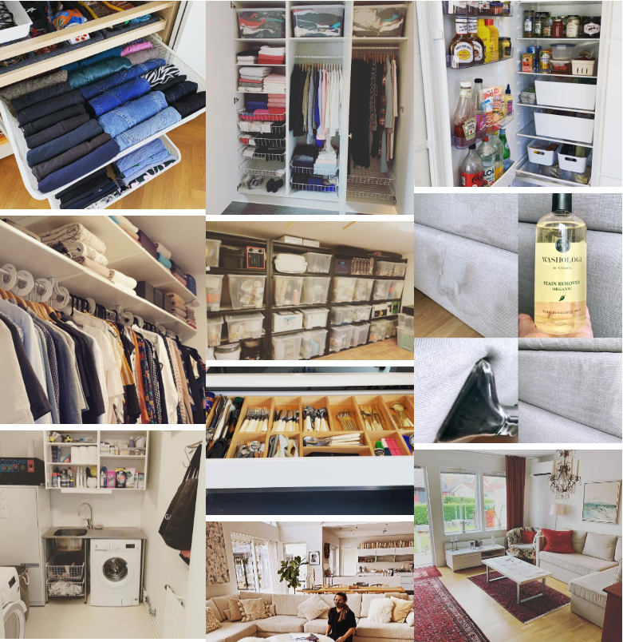

- __The contact Page__

  - This page will allow the user to choose which service they need. The user will be asked to submit their full name and email address. 

- __The confirmation Page__

  - This page will confirm to the users that we receive their message and we will reach out as soon as possible.
  
 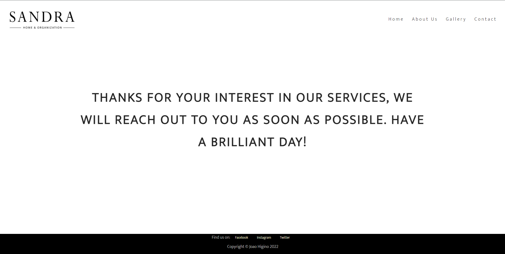

### Features Left to Implement

- Add some videos demonstrating our different types of services.

## Technologies Used

- [HTML5](https://en.wikipedia.org/wiki/HTML5)
- [CSS3](https://en.wikipedia.org/wiki/Cascading_Style_Sheets)
- [Gitpod](https://www.gitpod.io) - was used to create the website
- [Github](https://github.com) - was used to store repository of website and deploy the website
- [Chrome Dev Tools](https://developer.chrome.com/docs/devtools) - was used to view and experiment with styles
- [Google Fonts](https://fonts.google.com) - was used to find the fonts for the website
- [Pexels](https://www.pexels.com) - provided the images seen throughout the website
- [Grammarly](https://app.grammarly.com) - was used to check typography.
- [Am I Responsive](https://ui.dev/amiresponsive?url=https://joaohigino.github.io/SandraHomeOrganization/) - was used to produce the website mockup.

## Browser testing

- Chrome
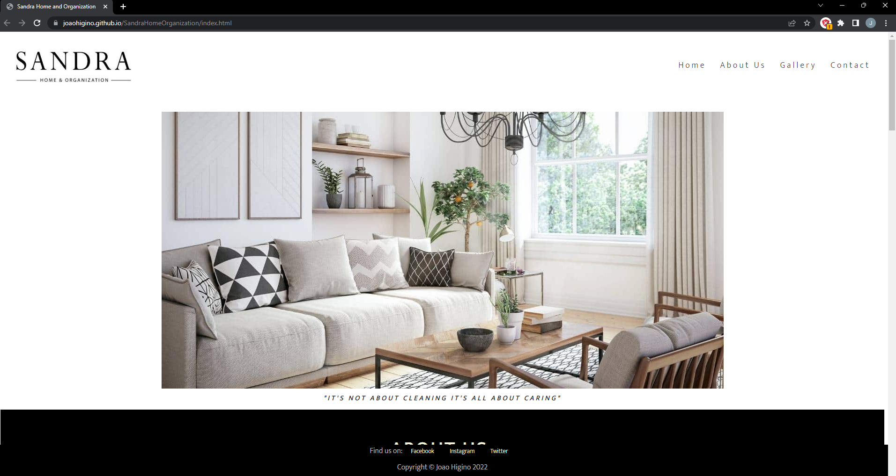
- Opera
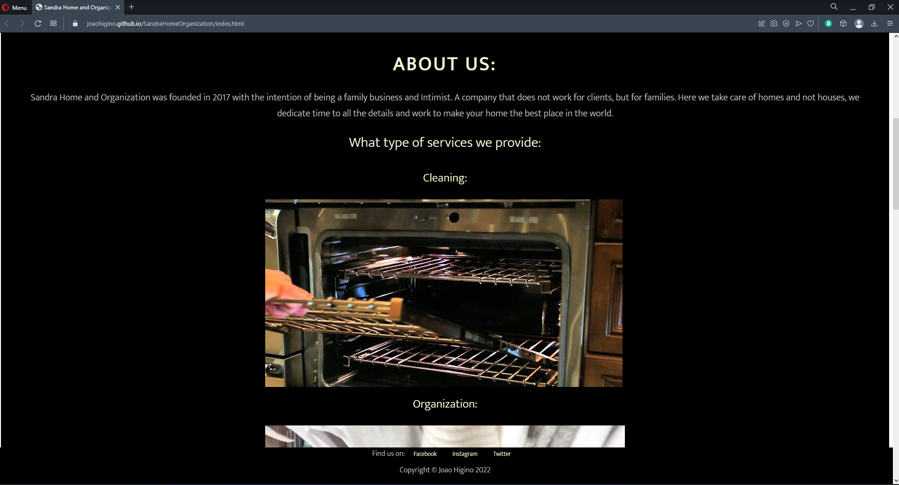
- Edge
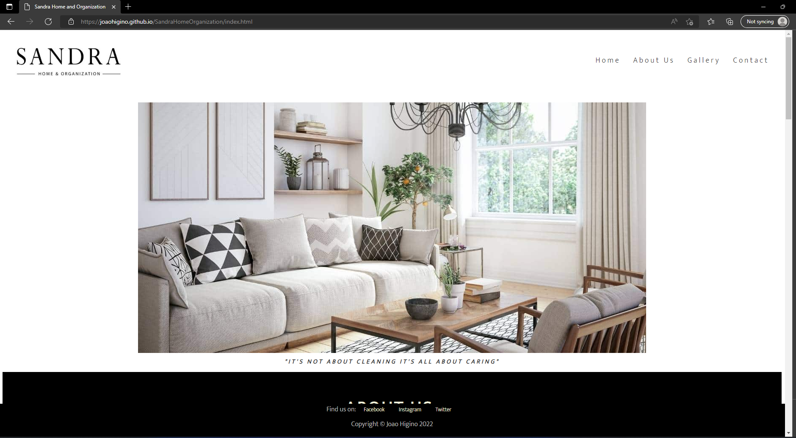
- Safari
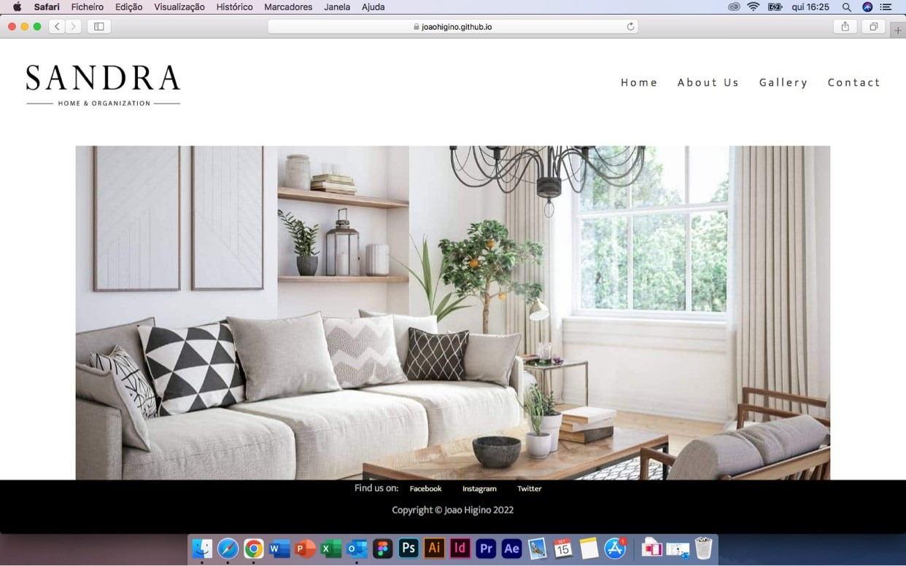

## Mobile Testing 

- The website was viewed on a variety of devices such as desktops, Laptops, Apples Products and a range of Android devices:
  - IPad Mini
  
  - iPhone 12 Pro
  
  - Samsung Galaxy Fold
  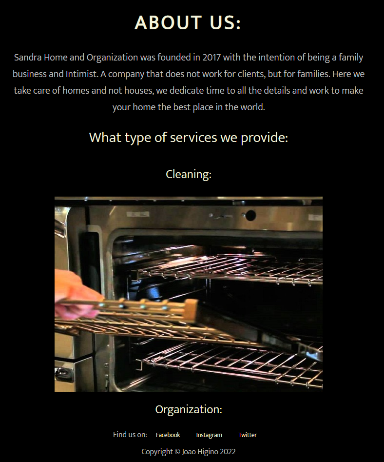
  - Samsung Galaxy S20
  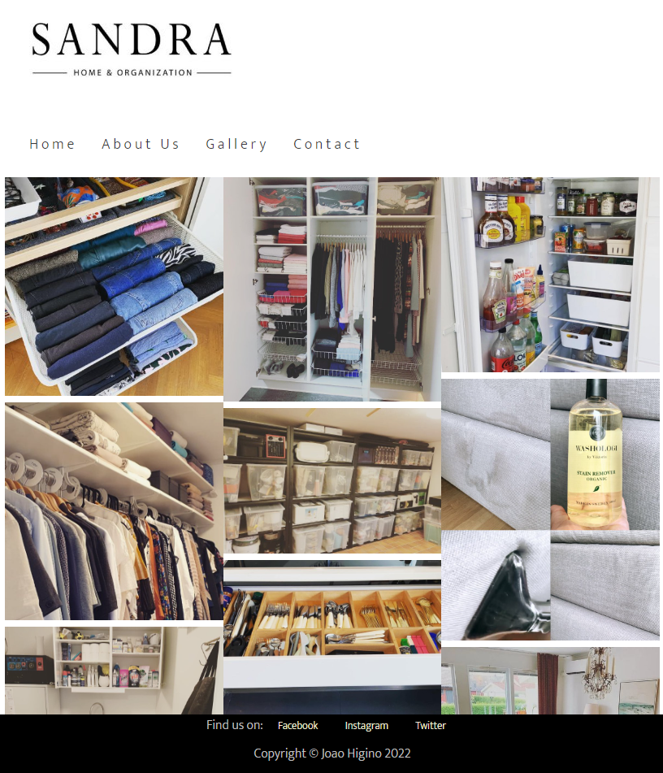

### Validator Testing 

- HTML
  - No errors were returned when passing through the official
  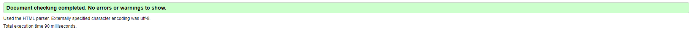
  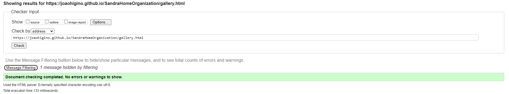
  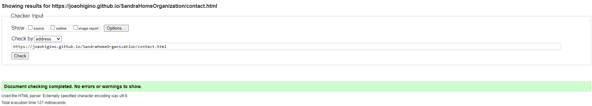

- CSS
  - No errors were found when passing through the official
  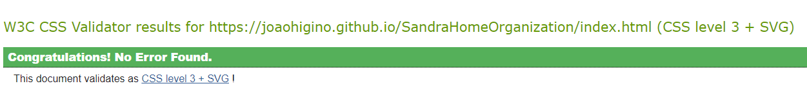
  
- Lighhouse
  - The site scored well
 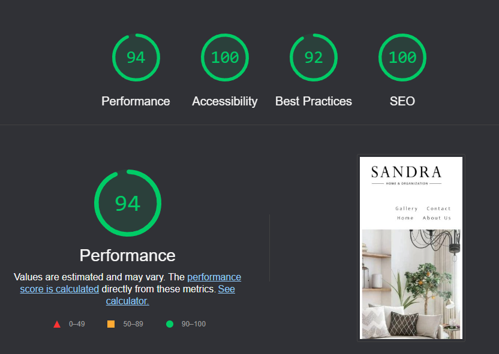
  - The low performance is due to large image dimensions.
 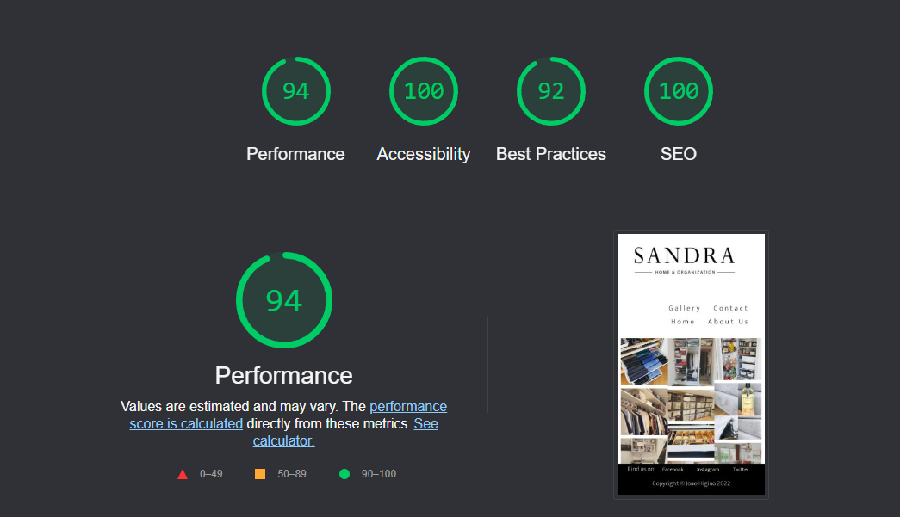
  - The low performance is due to large image dimensions.
 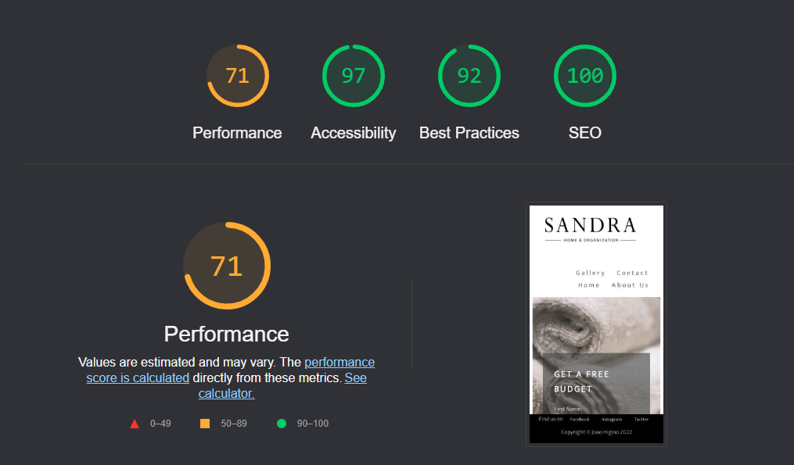

### Unfixed Bugs

No unfixed bugs that i am aware.

## Deployment

The site was deployed to GitHub pages. The steps to deploy are as follows: 
  - In the [GitHub repository](https://github.com/JoaoHigino/SandraHomeOrganization), navigate to the Settings tab 
  - From the source section drop-down menu, select the **Main** Branch, then click "Save".
  - The page will be automatically refreshed with a detailed ribbon display to indicate the successful deployment.

The live link can be found [here](https://joaohigino.github.io/SandraHomeOrganization)

### Local Deployment

In order to make a local copy of this project, you can clone it. In your IDE Terminal, type the following command to clone my repository:

- `git clone https://github.com/JoaoHigino/SandraHomeOrganization.gitX`

Alternatively, if using Gitpod, you can click below to create your own workspace using this repository.

## **Content**

All content was written by developer. 

## Acknowledgements

- To my amazing wife Sandra, my best friend, my mentor, and my safe haven, without her, all my dreams will be impossible to achieve. She is everything.
- To my two kids, Maria and Thomas, with them life is easy and light. They make me laugh and think that our future is bright.
- To my family and friends - for being a great support and providing a lot of the user testing for me, especially my friends from "Liga 7 BP" with their craziness helped me to clean my head.
- To my mentor Tim Nelson for all his guidance, support, tips, and feedback.
- The Code Institute community on slack and my classmates its been a pleasure so far.
